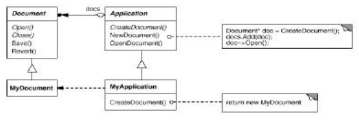

**Factory Method**

**¿En qué consiste?**

Consiste en poder crean objetos sin exponer la lógica de creación al cliente y se hace referencia a objetos recién creados utilizando una interfaz común.

Por esto, define una interfaz (una abstracción) para la creación de un objeto, pero permite a sus subclases decidir la clase a instanciar, Factory Method permite que una clase difiera la creación de instancias en subclases. (Es decir crea objetos sin saber exactamente cuál es su instancia concreta)

Define un constructor &quot;Virtual&quot;

El operador &quot;New&quot; se considera perjudicial (difícil de implementar)

**Motivación:**

**Ej.** Dado un framework para presentar documentos (clase abstracta), se necesitan crear documentos sin depender del tipo de documento.

**Ventajas:**

- Limpieza del diseño.
- Eliminación de dependencias de uso innecesarias o engorrosas.
- Mayor abstracción y posibilidad de reutilización de código.

**Estructura**
 

**¿Cuándo aplicarlo?**

- Una clase no puede anticipar la clase de objeto que debe ser creada.
- Una clase quiere que sus subclases especifiquen el objeto

** ¿Cómo aplicarlo?**

- Diseñe los argumentos para el método de fábrica. ¿Qué cualidades o características son necesarias y suficientes para identificar la clase derivada correcta para instanciar?
- Considere diseñar un &quot;conjunto de objetos&quot; interno que permita reutilizar los objetos en lugar de crearlos desde cero.
- Considere hacer que todos los constructores sean privados o protegidos.

**Buenas prácticas de este patrón:**

- Es común encontrar numerosas implementaciones que comienzan con el uso de este patrón, debido a su simplicidad y personalización, y evolucionan hasta el factory method (mas complejo y flexible).
- La ventaja del factory method es la posibilidad de retornar la misma instancia múltiples veces, o puede retornar una subclase en lugar de un objeto de un tipo exacto.
- El operador &quot;New&quot; se considera peligroso, es la diferencia entre requerir un objeto y crear uno, el operador &quot;New&quot; siempre crea un objeto nuevo, y falla en encapsular la creación de dicho objeto. Este método se esfuerza en la encapsulación y permitir un objeto ser requerido sin requerir el proceso de creación.
